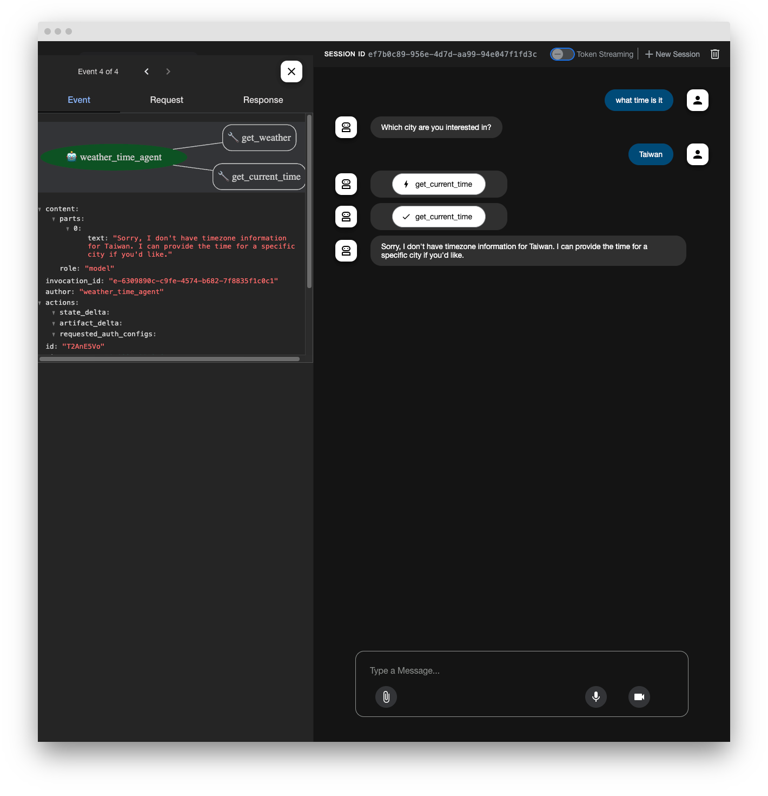

# Google ADK

## Installation

```
uv venv --python 3.11
uv pip install google-adk
```

## Usage

### Project structure

You will need to create the following project structure.

```
parent_folder/
    multi_tool_agent/
        __init__.py
        agent.py
        .env
```

So let's create a multi_tool_agent folder first.

```
mkdir multi_tool_agent/
```

Create a `__init__.py` file in the folder.

```
from . import agent
```

Then let's create a `agent.py` file. Here is a sample code from Google Quickstart.

```
import datetime
from zoneinfo import ZoneInfo
from google.adk.agents import Agent

def get_weather(city: str) -> dict:
    """Retrieves the current weather report for a specified city.

    Args:
        city (str): The name of the city for which to retrieve the weather report.

    Returns:
        dict: status and result or error msg.
    """
    if city.lower() == "new york":
        return {
            "status": "success",
            "report": (
                "The weather in New York is sunny with a temperature of 25 degrees"
                " Celsius (77 degrees Fahrenheit)."
            ),
        }
    else:
        return {
            "status": "error",
            "error_message": f"Weather information for '{city}' is not available.",
        }


def get_current_time(city: str) -> dict:
    """Returns the current time in a specified city.

    Args:
        city (str): The name of the city for which to retrieve the current time.

    Returns:
        dict: status and result or error msg.
    """

    if city.lower() == "new york":
        tz_identifier = "America/New_York"
    else:
        return {
            "status": "error",
            "error_message": (
                f"Sorry, I don't have timezone information for {city}."
            ),
        }

    tz = ZoneInfo(tz_identifier)
    now = datetime.datetime.now(tz)
    report = (
        f'The current time in {city} is {now.strftime("%Y-%m-%d %H:%M:%S %Z%z")}'
    )
    return {"status": "success", "report": report}


root_agent = Agent(
    name="weather_time_agent",
    model="gemini-2.0-flash",
    description=(
        "Agent to answer questions about the time and weather in a city."
    ),
    instruction=(
        "You are a helpful agent who can answer user questions about the time and weather in a city."
    ),
    tools=[get_weather, get_current_time],
)
```

Let's create a `.env` file. You can get an API key from [Google AI Studio](https://aistudio.google.com/apikey).

```
GOOGLE_GENAI_USE_VERTEXAI=FALSE
GOOGLE_API_KEY=PASTE_YOUR_ACTUAL_API_KEY_HERE
```

Replace `GOOGLE_API_KEY` with your actual `API KEY`.

Let's run it.

```
adk web
```



If run API Server

```
adk api_server
```

Use this API for testing:

1. Create a new session

Command:

```bash
curl -X POST http://0.0.0.0:8000/apps/multi_tool_agent/users/u_123/sessions/s_123 \
  -H "Content-Type: application/json" \
  -d '{"state": {"key1": "value1", "key2": 42}}'
```

Output:

```
{"id":"s_123","app_name":"multi_tool_agent","user_id":"u_123","state":{"state":{"key1":"value1","key2":42}},"events":[],"last_update_time":1745849689.1271749}
```

2. Send a query. The API is the `/run`.

```bash
curl -X POST http://0.0.0.0:8000/run \
-H "Content-Type: application/json" \
-d '{
"app_name": "multi_tool_agent",
"user_id": "u_123",
"session_id": "s_123",
"new_message": {
    "role": "user",
    "parts": [{
    "text": "Hey whats the weather in new york today"
    }]
}
}'
```

Output:

```
[{"content":{"parts":[{"functionCall":{"id":"adk-6b2e2fe2-4d80-4b86-adef-db678b1fa996","args":{"city":"new york"},"name":"get_weather"}}],"role":"model"},"invocation_id":"e-91d253e1-56d5-4fab-86fb-589c470f9200","author":"weather_time_agent","actions":{"state_delta":{},"artifact_delta":{},"requested_auth_configs":{}},"long_running_tool_ids":[],"id":"QHwUZURz","timestamp":1745849711.067688},{"content":{"parts":[{"functionResponse":{"id":"adk-6b2e2fe2-4d80-4b86-adef-db678b1fa996","name":"get_weather","response":{"status":"success","report":"The weather in New York is sunny with a temperature of 25 degrees Celsius (77 degrees Fahrenheit)."}}}],"role":"user"},"invocation_id":"e-91d253e1-56d5-4fab-86fb-589c470f9200","author":"weather_time_agent","actions":{"state_delta":{},"artifact_delta":{},"requested_auth_configs":{}},"id":"5zVrSW7J","timestamp":1745849711.786513},{"content":{"parts":[{"text":"OK. The weather in New York is sunny with a temperature of 25 degrees Celsius (77 degrees Fahrenheit).\n"}],"role":"model"},"invocation_id":"e-91d253e1-56d5-4fab-86fb-589c470f9200","author":"weather_time_agent","actions":{"state_delta":{},"artifact_delta":{},"requested_auth_configs":{}},"id":"hV6jXeDD","timestamp":1745849711.787121}]
```


## Reference

- https://google.github.io/adk-docs/get-started/quickstart/#venv-install