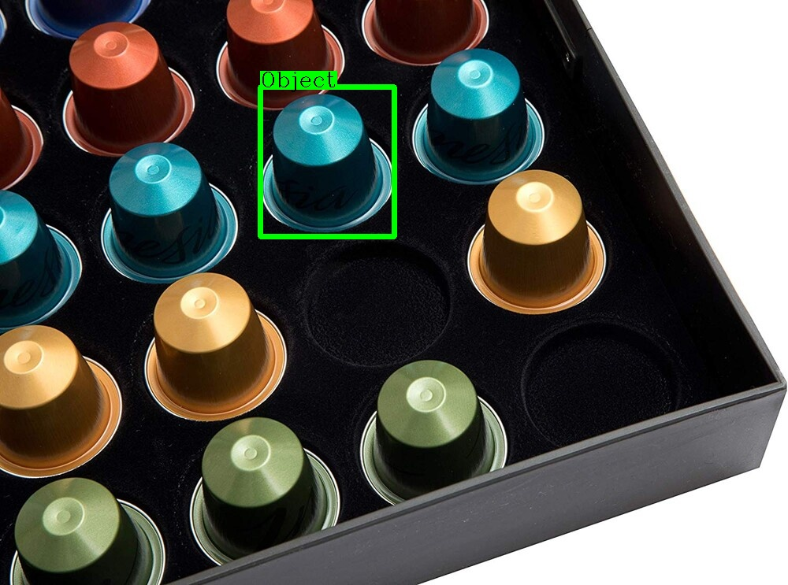

# Demonstrate how to use OpenCV to draw the class name with background

Mainly the hard part in here is how to get the word size from putText?

We will use the `cv2.getTextSize` to get the text size. 

Here is the result below:

| Before           | After           |
| ---------------- | --------------- |
|  |  |

