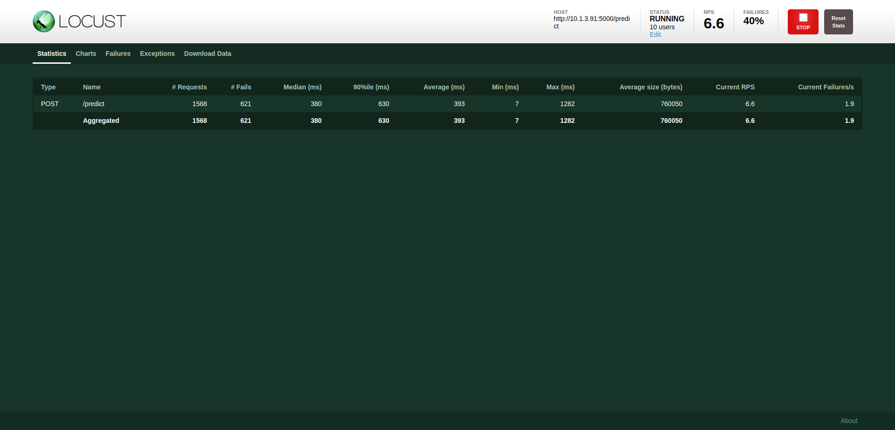
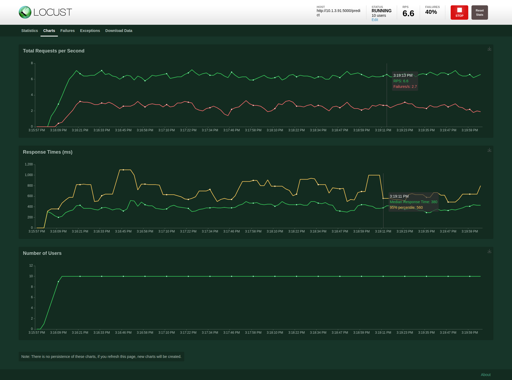

# Stress tests
Here we are using Locust tool to do tests.

For example, I did some experiments for our Triton inference server and Webserver with 10 users. 
Each user will run two models which model will send 10 times request post and each post will sleep 1 sec.

First graph shows that there are 1568 requests including 621 failures, but according to my experience is because of sleep time. If I let them sleep 10 sec per user, it wont happen errors. (The error was that WebServer didnt receive images.)


Here is more detail information.

>**NOTES:** 
Type: request type, that is, the request method of the interface;
Name: request name;
Requests: the number of completed requests;
Fails: the number of current failures;
Median: The middle value of the response time, that is, 50% of the response time is within this value range, in milliseconds;
90%ile: According to the normal distribution, 90% of the response time is below the average value of the normal distribution, that is, less than this value;
Average: average response time in milliseconds;
Min: The minimum response time, in milliseconds;
Max: Maximum response time, in milliseconds;
Average Size: the average amount of data per request, in bytes;
Current RPS (requests per second): The number of requests processed per second, namely RPS. (Previously called reqs/sec: the number of requests processed per second, ie QPS;), so these two can be regarded as one.

---
# Usage

## No GUI
```
locust -f triton_test.py -H (Your web link) -u 2 -r 1 -t 30s --headless
```

## Use GUI

```
locust -f triton_test.py -H (Your web link) 
```

Open `http://0.0.0.0:8089/`
