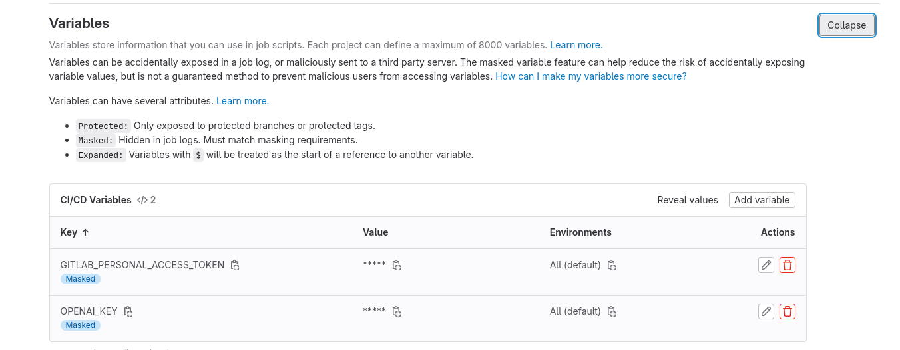

## Setting

1. Go to Setting > CI/CD 
2. Expand "Variables" and Click "Add variable"
3. Add two variables.

### `GITLAB_PERSONAL_ACCESS_TOKEN`

- Visibility: `Masked`
- Key: `GITLAB_PERSONAL_ACCESS_TOKEN`
- Vale: {your value}
- No Flags

### `OPENAI_KEY`

- Visibility: `Masked`
- Key: `OPENAI_KEY`
- Vale: {your value}
- No Flags
